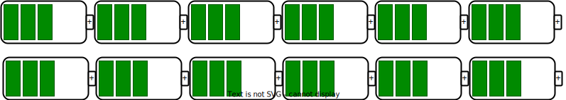

<!-- markdownlint-disable MD033 -->
## Battery Configuration

In an electric vehicle (EV), the battery configuration refers to the arrangement of individual battery cells within the battery pack. The battery configuration can affect the voltage, capacity, power output, and other aspects of the battery pack and the overall vehicle performance.
The most common configuration for EV batteries is a series-parallel hybrid. In this configuration, multiple cells are connected in series to increase the battery pack's voltage, and multiple groups of series-connected cells are then connected in parallel to increase the battery pack's overall capacity.

The series connection of cells increases the battery pack’s voltage output, which is vital for providing the necessary power to drive the vehicle. The parallel connection of cell groups increases the battery pack’s capacity, which is essential for storing the energy required to drive the car to a desired range.

To calculate the gross battery pack size, multiply the total parallel capacity in Ah (ampere-hours) by the battery pack nominal voltage in Volts. The results are in WH watt-hours.

### Example: Audi Q8 e-tron 55

The diagram below shows the configuration of a battery module from Audi Q8 e-tron 55. This module contains 12 battery cells, four of which are mounted in parallel, and there are three groups of this parallel configuration in serial.

<figure>

<figcaption>
        

            3s4p module
        

    </figcaption>
</figure>

Each cell has a nominal voltage of 3.6667 volts and a capacity of 72 AH.

Three cells in serial give a module voltage of 11 Volt. 4 x 72AH in paralell gives a total module capacity of 72 x 4 = 288 AH. Q8 e-tron 55 has a total of 36 modules in serial. 36 x 11 volts gives 396 volts for the pack. 396 Volts x 288 aH = 114048 Wh or 114 kWh gross capacity.

### Example: Tesla Model Y Long Range

The Tesla Model Y Long Range uses 4416 cells in the small 21700 format, with 96 rows and 46 cells in parallel.

Each cell is 4.8 Ah with a nominal voltage of 3.7 Volt. 4.8ah x 46 gives a total of 220.8 ah. 96 x 3.7 Volt gives a nominal pack voltage of 355 volts. This configuration provides a gross capacity of 355 * 220.8 = 78.4kWh.

### Example: Kia EV 6 Long-range

The Kia EV6 long-range battery has 384 cells in total. The cells are configured in 192 rows, with two cells in parallel, and are structured in modules with 12 cells.

<figure>

<figcaption>
        

            6s2p module
        

    </figcaption>
</figure>

Each cell is 55.6 AH.  2 x 55.6 = 111.2 AH. The nominal voltage is 3.63 per cell. 192 x 3.63 = 696.96 Volts nominal for the pack. 696.96 * 111.2 = 77.5kWh.

### More battery pack examples 
Here are some configuration examples

<table class="table table-striped border">
    <thead>
        <tr>
        <th>Model
        </th>
        <th>Gross Capacity
        </th>
        <th>Configuration
        </th>
        <th>Nominal Voltage
    </thead>
    <tbody>
    <tr>
        <td>Audi Q8 e-tron</td>
        <td>116kWh</td>
        <td>108s4p</td>
        <td>396 Volt</td>
    </tr>
    <tr>
        <td>Audi e-tron GT</td>
        <td>93.7kWh</td>
        <td>198s2p</td>
        <td>725 Volt</td>
    </tr>
    <tr>
        <td>Kia EV6 GT</td>
        <td>77.4</td>
        <td>192s2p</td>
        <td>697 Volt</td>
    </tr>
    <tr>
        <td><a href="../../../models/nio/">Nio 100KWh Battery</a></td>
        <td>100kWh</td>
        <td>96s1p</td>
        <td>358 Volt</td>
    </tr>
    <tr>
        <td><a href="../../../models/mercedes/eqe/">Mercedes EQE</a></td>
        <td>96,12 kWh</td>
        <td>90s4p</td>
        <td>328 Volt</td>
    </tr>
    <tr>
        <td><a href="../../../models/mercedes/eqs/">Mercedes EQS</a></td>
        <td>120kWh</td>
        <td>108s4p</td>
        <td>396 Volt</td>
    </tr>
    <tr>
        <td><a href="../../../models/tesla/model_y/model_y_long_range/">Tesla Model Y Long Range</a></td>
        <td>78.1kWh</td>
        <td>96s46p</td>
        <td>357 Volt</td>
    </tr>
    <tr>
        <td>Rivan R1S Large pack</a></td>
        <td>135kWh</td>
        <td>108s72p</td>
        <td>390 Volt</td>
    </tr>
    <tr>
        <td>Rivan R1S Max pack</a></td>
        <td>149kWh</td>
        <td>108s72p</td>
        <td>390 Volt</td>
    </tr>
      <tr>
        <td>Porsche Macan / Audi Q6</a></td>
        <td>100kWh</td>
        <td>180s1p</td>
        <td>662 Volt</td>
    </tr>
</tbody>
</table>

The specific battery configuration used in an EV depends on a variety of factors, such as the desired range, power output, and overall vehicle weight.



### 400 or 800 volts?

Manufacturers typically configure the packs to be around 400 volts or 800 volts.

A higher voltage battery configuration, such as an 800-volt system, can offer some advantages over a lower voltage 400-volt system but also has potential drawbacks. Here are some of the pros and cons of each configuration:

#### Pros 400 Volt package

**More mature technology:** 400-volt battery systems have been around longer and are more widely used in electric vehicles, which means they are more proven and reliable.

**Lower cost:** Because they are a more established technology, 400-volt battery systems tend to be less expensive to produce than higher-voltage systems.

**Widely available charging infrastructure:** Many public charging stations support 400-volt charging, making it easier to find places to charge your EV. For example, the Tesla Supercharger network does not support 800 Volts charging.

**More available cell configurations:** 400 Volt packs can be configured in more ways, giving the manufacturer more cell options.

#### Cons 400 Volt package

**Slower charging:** A 400-volt battery system typically requires longer charging times than an 800-volt system, which can be a disadvantage if you need to charge your vehicle quickly. This limitation is because chargers have limitations on current. Many chargers are limited to 500 amps. 500 amps x 400 volts = 200kW. On an 800-volt charger with the same current limitations, the result would be 500 Amps x 800 Volts = 400kW charging power.

**Limited power output:** 400-volt battery systems may not be able to deliver the same power output as an 800-volt system, which could limit the EV’s acceleration and performance. This limitation does not seem to be an issue with current models.

**Heavier:** A 400-volt battery system may require thicker cables to support the same charging speed.

#### Pros 800 Volt package

**Faster charging:** An 800-volt battery system can support faster charging speed than a 400-volt system so you spend less time charging.

**Higher power output:** An 800-volt battery system can deliver more power output, which can provide better acceleration and performance, but in reality, the most powerful batteries are 400 Volts, so this is not a real benefit.

**Lighter weight:** An 800-volt battery system may require thinner cables to support high-speed charging.

#### Cons 800 Volt package:

**Limited charging infrastructure**: Fewer public charging stations currently support 800-volt charging, which means it may be harder to find places to charge your EV at full speed. 

For example, the largest charging network,  the Tesla Supercharger network, charges at a maximum of 500 Volts. Charging an 800-volt car on these chargers requires that the EV converts the charger voltage to 800 volts, and conversion typically
limits the charging speed substantially. The manufacturers use Different techniques for this conversion. See the charging chapter for details.  

**Requires smaller cells**: Since you would at least need around 170 cells in serial to create an “800 volts” package, this prevents the usage of the largest cells. Larger cells give higher density and less wiring.



## Battery pack designs

There are some standard designs used to build the battery pack. 

## Cell-to-module

Cell-to-module (C2M) design involves assembling multiple battery cells into a single, self-contained module with integrated electronics and cooling systems. The modules can then be easily connected to form the complete battery pack. 

Each module has its own BMS (battery management system) that monitors and controls the charging and discharging of the cells within the module, allowing for more precise control and monitoring of the individual cells.



With C2M technology, multiple battery cells are assembled into a single, self-contained module with integrated electronics and cooling systems. The modules can then be easily connected together to form the complete battery pack. Each module has its own BMS (battery management system) that monitors and controls the charging and discharging of the cells within the module, allowing for more precise control and monitoring of the individual cells.



### Cell-to-Module (CtM) Advantages:

**Modularity:** CtM designs allow for individual battery modules to be replaced or serviced independently. If a module fails, it can be swapped out without affecting the entire battery pack.

**Thermal Management:** Modules provide space for thermal management components (such as cooling plates or liquid cooling channels). This helps regulate cell temperature and ensures optimal performance.

**Scalability:** CtM designs allow flexibility in configuring battery packs. Manufacturers can adjust the number of modules to meet different vehicle requirements (e.g., range, power, or size).

**Safety:** Isolating cells within modules enhances safety. If a cell experiences thermal runaway or other issues, it won’t directly impact neighboring cells.

**Manufacturing Efficiency:** Building modules separately simplifies assembly and quality control. It also enables parallel production of modules, streamlining the manufacturing process.



## Cell-to-pack

Cell-to-pack (CTP) batteries are a new type of battery technology that eliminates the need for battery modules by integrating the cells directly into the pack.

Several companies, such as Tesla, BYD, and CATL, are developing this technology.



BYD Blade and CATL Qilin are two examples of CTP batteries. The main difference between these two batteries is their cooling system.



BYD Blade uses a liquid cooling system, while CATL Qilin uses a structural cooling system. The 
structural cooling system is more efficient than the liquid cooling system used in BYD Blade.

### Cell-to-Pack (CtP) Advantages:

**Simplicity:** CtP designs eliminate the need for intermediate modules, reducing complexity. The battery pack directly integrates individual cells.

**Space Utilization:** Without modules, more space is available for cells, potentially increasing energy density.

**Cost Efficiency:** Fewer components (no modules) can lead to cost savings in production and assembly.

**Weight Reduction:** Eliminating module casings reduces overall weight, improving vehicle efficiency.

## Structural battery pack

A structural battery pack is a type of battery pack created so that it becomes a structural component of the EV.

This approach can reduce the EV’s weight by removing duplicate structures between the pack and the vehicle structure, as the battery pack becomes part of the vehicle structure.

This design can improve the EV’s overall performance and efficiency. Structural battery packs are still relatively new, but several companies and research institutions are exploring and developing them.

Structural battery packs, a game-changer in EV design, offer many benefits. They trim weight and complexity, boost performance, and facilitate seamless integration of battery technology across various applications.

Tesla Model Y and Tesla Cybertruck are two models that have structural packs. According to Tesla, this solution presents many advantages, such as significantly reducing the number of parts used in both the battery pack and the car.



More importantly, the company said the new cells and the structural pack are expected to increase the Model Y's range by 16 percent and decrease the car's overall weight by 10 percent, resulting in improved acceleration and handling.



Tesla uses pink polyurethane foam to encapsulate and secure the components within the structural battery pack. This foam serves as both an insulator and a structural element, providing rigidity and protection. The foam ensures that the battery cells and other critical components remain securely in place and acts as a firewall between different sections of the battery pack.

This foam is as strong as a brick, contributing to the overall structural integrity of the pack2

The below video shows a detailed analysis of the pack by Munro & Associates.



## Energy density at the battery pack level

The following table shows how pack density have varied over time between some example battery packs.

<table class="table table-striped border">
    <thead>
        <tr>
            <th>Pack</th>
            <th>Year</th>
            <th>Gross Capacity</th>
            <th>Weight</th>
            <th>Density</th>
        </tr>
    </thead>
    <tbody>
        <tr>
            <td>Tesla Roadster</td>
            <td>2010</td>
            <td>53kWh</td>
            <td>450kg</td>
            <td>118 Wh/kg</td>
        </tr>
         <tr>
            <td>Tesla Model S</td>
            <td>2012</td>
            <td>85kWh</td>
            <td>540kg</td>
            <td>157 Wh/kg</td>
        </tr>
         <tr>
            <td>Tesla Model X </td>
            <td>2015</td>
            <td>75kWh</td>
            <td>530kg</td>
            <td>141 Wh/kg</td>
        </tr>
         <tr>
            <td>Audi e-tron 55</td>
            <td>2018</td>
            <td>95kWh</td>
            <td>699kg</td>
            <td>136Wh/kg</td>
        </tr>
        <tr>
            <td>Volkswagen MEB</td>
            <td>2021</td>
            <td>82kWh</td>
            <td>493kg</td>
            <td>166Wh/kg</td>
        </tr>
          <tr>
            <td>Tesla Model 3 LFP</td>
            <td>2021</td>
            <td>60kWh</td>
            <td>477kg</td>
            <td>126Wh/kg</td>
        </tr>
         <tr>
            <td>Tesla Model S</td>
            <td>2022</td>
            <td>100kWh</td>
            <td>544kg</td>
            <td>184Wh/kg</td>
        </tr>
         <tr>
            <td>Audi Q8 e-tron 55 </td>
            <td>2022</td>
            <td>114kWh</td>
            <td>727kg</td>
            <td>157Wh/kg</td>
        </tr>
         <tr>
            <td>Kia EV6</td>
            <td>2022</td>
            <td>77.4kWh</td>
            <td>477kg</td>
            <td>162Wh/kg</td>
        </tr>
         <tr>
            <td>Mercedes EQXX</td>
            <td>2022</td>
            <td>107.8kWh</td>
            <td>495kg</td>
            <td>217Wh/kg</td>
        </tr>
        <tr>
            <td>BYD Seal LR (LFP)</td>
            <td>2022</td>
            <td>82.56kWh</td>
            <td>558kg</td>
            <td>148Wh/kg</td>
        </tr>
         <tr>
            <td>Nio Semi-Solid</td>
            <td>2023</td>
            <td>150kWh</td>
            <td>575kg</td>
            <td>260Wh/kg</td>
        </tr>
         <tr>
            <td>Audi Q6 e-tron / Porsche Macan EV</td>
            <td>2024</td>
            <td>100kWh</td>
            <td>570kg</td>
            <td>175Wh/kg</td>
        </tr>
    </tbody>
</table>

If you want to get the details about more packs we recomend <a href="https://www.batterydesign.net/maximising-pack-energy-density/">BatteryDesign.net</a>

    <a href="../cell/" class="text-decoration-none text-black"><strong><i class="bi-arrow-left"></i>  Cell Housing</strong></a>
    <a href="../batterymanagment/" class="text-decoration-none text-black float-end"><strong>Battery management <i class="bi-arrow-right"></i></strong></a>

